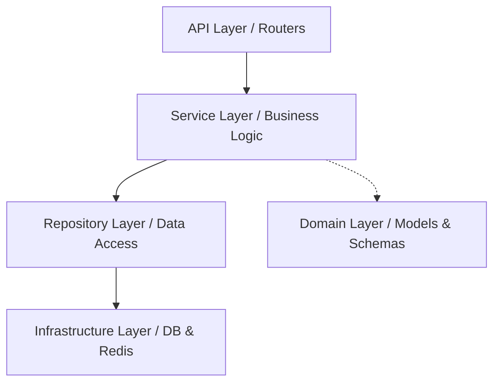

# 🏦 NexBill — Invoice Management System (Backend)

[](https://www.python.org/)
[](https://fastapi.tiangolo.com/)
[](https://www.docker.com/)
[](https://www.postgresql.org/)

NexBill is a high-performance, enterprise-grade Invoice Management System backend. Designed with **FastAPI** and **Clean Architecture** principles, it provides a robust foundation for managing clients, contracts, and automated billing workflows.

---

## ✨ Features

- **🔐 Secure Auth**: JWT-based authentication with fine-grained Role-Based Access Control (RBAC).
- **📋 Client & Contract Management**: Full lifecycle tracking for customer relationships and SLA-based contracts.
- **📑 Dynamic Invoicing**: Automated generation of PDF invoices using **WeasyPrint**.
- **💳 Payment Integration**: Native support for **Stripe** and **PayPal** hooks with built-in idempotency.
- **⚙️ Background Workers**: Scalable task processing using **Celery** and **Redis** for emails and batch jobs.
- **🏗️ Solid Foundation**: Strict Layered Architecture with the Repository Pattern and Unit of Work.
- **🆔 Modern Identifiers**: Uses **UUIDv7** for all public-facing identifiers, ensuring sorting and security.

---

## 🏗️ Architectural Excellence

NexBill follows a **Layered Architecture** to ensure business logic remains pure and decoupled from infrastructure details.



### Dependency Flow
1. **API Layer**: Route handlers that validate requests and manage HTTP responses.
2. **Service Layer**: Pure business logic and transaction management via the `get_db` Unit of Work.
3. **Repository Layer**: Abstracted data access calling SQLAlchemy `flush()`.
4. **Domain Layer**: Core entities, Pydantic schemas, and enums.

For a deep dive into our design decisions, see [BACKEND.md](BACKEND.md).

---

## 🚀 Quick Start

### 🐳 Using Docker (Recommended)

Run the entire ecosystem (App, DB, Redis, Celery) with one command:

1. **Clone & Enter**:
   ```bash
   git clone <repo-url> && cd nex-bill-backend
   ```
2. **Configure**:
   ```bash
   cp .env.example .env
   ```
3. **Launch**:
   ```bash
   docker-compose up -d --build
   ```
The API live-docs will be available at `http://localhost:8000/docs`.

---

## 🛠️ Local Development

If you prefer running without containers:

1. **Virtual Env**:
   ```bash
   python3 -m venv venv && source venv/bin/activate
   ```
2. **Install**:
   ```bash
   pip install -r requirements-dev.txt
   ```
3. **Migrate**:
   ```bash
   alembic upgrade head
   ```
4. **Run**:
   ```bash
   uvicorn app.main:app --reload
   ```

---

## 📂 Project Structure

```text
├── alembic/              # Database migrations
├── app/                  
│   ├── api/              # API Route handlers (v1)
│   ├── services/         # Business logic layer
│   ├── repositories/     # Data access abstraction
│   ├── models/           # SQLAlchemy ORM entities
│   ├── schemas/          # Pydantic validation models
│   ├── infrastructure/   # DB, Redis, Celery, Stripe config
│   └── tasks/            # Celery background tasks
├── tests/                # Unit and Integration suites
└── pyproject.toml        # Tooling configuration (Ruff, Mypy)
```

---

## 🔗 API Documentation

NexBill ships with interactive documentation out of the box:
- **Swagger UI**: [http://localhost:8000/docs](http://localhost:8000/docs)
- **ReDoc**: [http://localhost:8000/redoc](http://localhost:8000/redoc)

---

## 🧪 Quality Assurance

We maintain high standards through rigorous linting and testing.

```bash
# Run the test suite
pytest

# Auto-format and lint code
ruff format .
ruff check --fix .
```